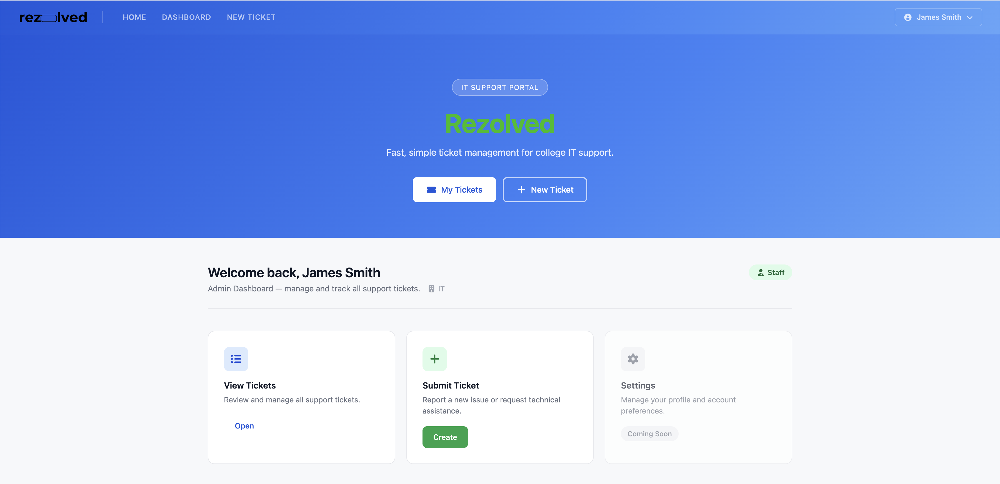
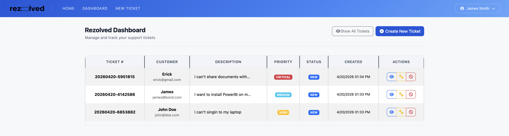
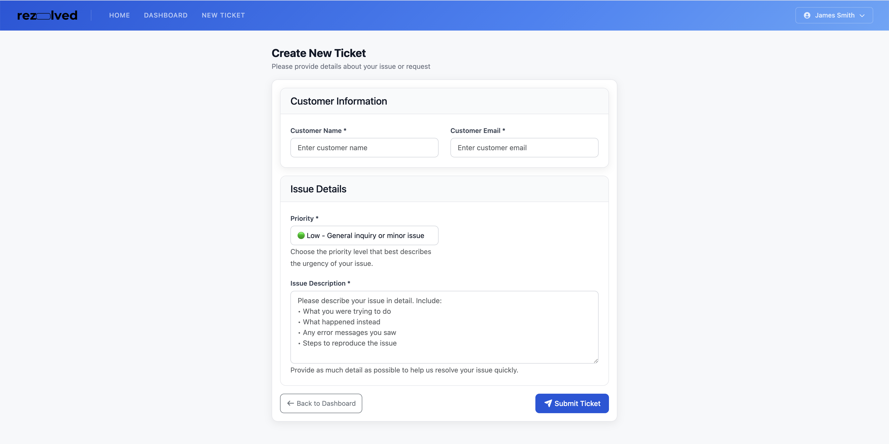
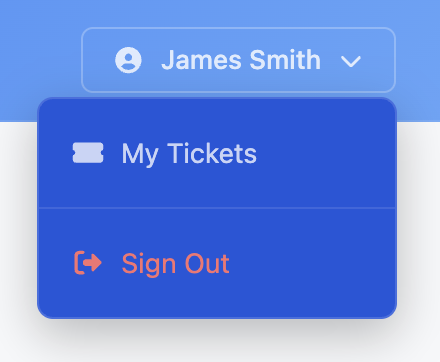

# Rezolved Client

Frontend for the Rezolved support ticket system.

## Admin Page Guide

This guide explains how the admin-facing pages work, based on the screenshots in client/src/assets.

### 1. Admin Home and Quick Actions



What this page is:
- The authenticated landing page for staff/admin users.
- It combines a hero section with shortcuts and role-aware cards.

How it works:
1. The top navbar gives quick access to Home, Dashboard, and New Ticket.
2. The hero buttons route to My Tickets and New Ticket.
3. The welcome section displays user info and role badge.
4. The action cards provide:
	- View Tickets: opens the ticket dashboard.
	- Submit Ticket: opens the new ticket form.
	- Settings: currently disabled and marked Coming Soon.

### 2. Ticket Dashboard (Admin Queue)



What this page is:
- The main operations table for reviewing and tracking tickets.

How it works:
1. Each row shows ticket number, customer, description, priority, status, created time, and actions.
2. Show All Tickets toggles visibility of closed/cancelled tickets.
3. Create New Ticket routes to the ticket creation form.
4. Actions per ticket:
	- Eye icon: open ticket details/edit page.
	- Cogs icon: open admin management page for status workflow.
	- Ban icon: cancel the ticket.

Role behavior:
1. Admin users can see the Manage action.
2. Non-admin users do not get the Manage action.

### 3. Create New Ticket Form



What this page is:
- A structured form to submit a new support request.

How it works:
1. Customer Information section captures customer name and email.
2. Issue Details captures priority and full issue description.
3. Submit Ticket sends the form to the API and creates a new ticket.
4. Back to Dashboard returns to the ticket list without submitting.

Validation notes:
1. Required fields must be provided before submit.
2. Description should contain enough detail for triage and assignment.

### 4. User Dropdown and Sign Out



What this area is:
- The authenticated account menu in the top-right navbar.

How it works:
1. My Tickets navigates to the dashboard list.
2. Sign Out clears session auth data and returns to the home page.

### 5. Navigation and Route Summary

Main routes used by admins:
1. / for Home.
2. /tickets for dashboard list.
3. /tickets/add for new ticket creation.
4. /tickets/edit/:id for ticket details.
5. /tickets/manage/:id for admin-only ticket management workflow.

Access control summary:
1. Ticket pages require authentication.
2. Status management route is restricted to admin role.

## Development

### Install

Run from the project root:

```bash
cd client
npm install
```

### Start

```bash
cd client
npm run dev
```

### Required environment variable

Create client/.env with:

```bash
VITE_APP_APIURL=http://localhost:3001
```
